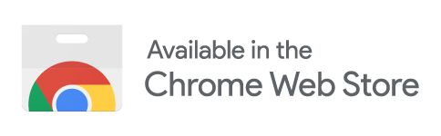
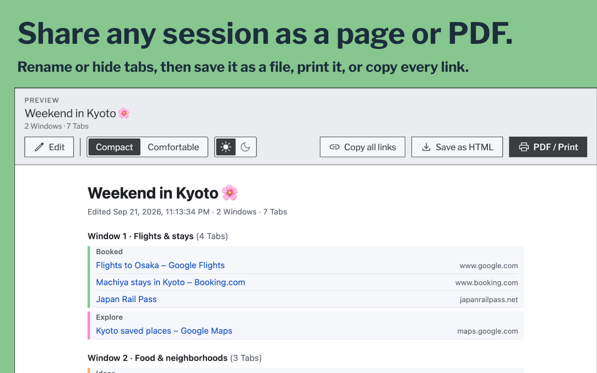

# Tab Keeper - Chrome Tab Manager & Sync Tool

Tab Keeper is an intuitive Chrome extension crafted to redefine the way users save, organize, and interact with their browser tabs. With the smart integration of the Chrome Storage API as a shared token storage, Tab Keeper ensures that users can seamlessly sync their data across Chrome browsers on desktop devices without signing up with their personal emails.
  

 

## Built With

- [TypeScript](https://www.typescriptlang.org/)
- [React](https://react.dev/)
- [Redux Toolkit](https://redux-toolkit.js.org/)
- [Chrome API](https://developer.chrome.com/docs/extensions/reference/)
- [Vite](https://vitejs.dev/)
- [Vitest](https://vitest.dev/)
- [Cloud Firestore](https://firebase.google.com/docs/firestore)
- [Firebase SDK](https://firebase.google.com/docs/web/setup)
- [Firebase Authentication](https://firebase.google.com/docs/auth)
- [i18n React](https://react.i18next.com/)
- [Emotion CSS](https://emotion.sh/docs/introduction)
- [base64.js](https://github.com/dankogai/js-base64)
- [uuid](https://github.com/uuidjs/uuid)
   

## Screenshots

[View All Screenshots →](https://github.com/justine-george/tab-keeper-react-chrome-extension/wiki/Screenshots)
  

## Features

- 🔖 Streamlined Tab Management: Keep your browser tabs well-organized and easily accessible. Move from an unmanaged heap of tabs to a highly organized collection.

- 🌍 Multilingual Support: With i18n React, Tab Keeper now offers internationalization, supporting languages such as English, German, Chinese, Japanese, French, Portuguese, Russian, Spanish, Italian, and Hindi.

- 🌐 Sync Across Devices: Utilize the advanced Chrome sync integration to synchronize your saved tabs across Chrome browsers on desktop devices. No more manual setups or repetitive logins.

- 🔒 Uncompromised Privacy: Your privacy is paramount. Tab Keeper operates without requiring a separate user login, ensuring that your data is protected.

- 🔍 Quick Tab Search: Find your saved tabs in an instant with our efficient search functionality.

- 🌓 Multiple Themes: Personalize your interface by selecting from a variety of themes.
    

## Blog Posts

[View All Posts →](https://github.com/justine-george/tab-keeper-react-chrome-extension/wiki/Blog-Posts)
  

## Changelog

### v.1.6.0 (Latest)

#### Features

- Saved sessions now keep your Chrome tab groups, with their names and colors, and restore them the same way
- Tab group support asks for its extra permission only when you have tab groups to save, and works without it otherwise

#### Fixes

- Undoing a session you just created is no longer brought back by the next sync
- Undo no longer reports that changes arrived from another device when nothing did
- A session can no longer be saved or renamed to an empty title and left nameless
- Session dates now follow your own language and region instead of always being English and US-formatted
- Error messages and the empty-session text now appear in your own language, and a mistyped German label is corrected
- Clearing the search box no longer jumps you to a session you were not looking at
- A cloud copy the app cannot read is now explained instead of leaving the sync icon in an error state with no reason given
- The sync icon no longer offers to sync when your device and the cloud already agree
- Dialogs now keep keyboard focus inside them, so Tab can no longer reach the page behind
- The rating prompt can now be dismissed with the keyboard, and its button no longer wraps in most languages
- A session's title can now be renamed with the keyboard
- Buttons that show only an icon now show a pointer cursor
- Settings now marks which theme is active, and its switches say what they control
- Hovering a session no longer makes it look selected
- Hovering the selected settings category no longer makes it look unselected
- The second session in the list no longer flashes when a new session is created
- A session row's buttons and its highlight now appear together instead of one without the other
- A session row now fills evenly when you point at it, with no visible edge where the buttons begin
- The divider between saved sessions no longer disappears behind the action buttons
- The highlight on a session's action buttons no longer sits flush against the row's edge on some rows and not others

#### Improvements

- The app no longer makes failing cloud requests while it is still signing in

### v.1.5.0

#### Features

- Save just the current window as a session, instead of always saving every open window
- Every button, list row and menu item can now be reached with Tab and used with Enter or Space
- Screen readers now announce every control correctly, and in your own language rather than in English
- Disabled controls are no longer focusable, and are announced as disabled instead of as ordinary buttons

#### Fixes

- Renaming a session no longer loses what you have typed when a sync or an undo arrives while you are editing
- An undone rename no longer reappears on the next sync
- Redo now works on macOS, where the Cmd+Shift+Z shortcut previously did nothing at all
- Cmd+Z inside a text field now undoes your typing instead of the app's last action
- Typing in the search box no longer clears the redo history or floods the undo history
- Search results now report how many matches were found, instead of repeating the session's own window and tab counts
- Sessions are now ordered and dated by the instant they were created, so their order no longer depends on the device's clock
- The focus-mode confirmation no longer says your windows are "already saved" when there was nothing to save
- Focus mode no longer saves popup windows that it cannot reopen later
- A session too large to sync is now refused with an explanation, instead of leaving sync stuck for good
- Selecting or searching a session no longer changes when that session was last modified, which could let an older copy win a sync
- The message shown when a sync fails now appears in your own language
- The area around the app now follows your chosen theme instead of staying grey
- Icon spacing inside buttons now renders as intended

#### Improvements

- Selecting or searching a session no longer triggers a cloud sync

### v.1.4.1

#### Fixes

- Search results now show a window's own title when only its tabs match, instead of borrowing the title of one of those tabs
- Collapsing or renaming a window no longer affects the wrong row after a window or tab is added to a session
- Switching themes now applies the new colors immediately instead of fading through the old ones, and the scrollbar changes with them
- The Auto Sync button no longer flashes as you move between settings sections
- A backup too large to sync is now refused when you restore it, with an explanation, instead of being loaded and leaving sync stuck
- Restoring a backup now tells you when it could not be saved to the cloud, instead of always reporting success
- Restoring a backup saved by an older version no longer fails to sync on its first attempt

#### Improvements

- Dependent packages updated to latest versions

[View All Changelog →](https://github.com/justine-george/tab-keeper-react-chrome-extension/wiki/Changelog)
  

## Contributing

Contributions are welcome! Feel free to open issues or submit pull requests following the established coding style and guidelines.

Run `npm test` for the unit and component suites, and `npm run test:e2e` for the browser tests against a real build ([details](e2e/README.md)).
  

## License

Tab Keeper is released under the [MIT License](https://raw.githubusercontent.com/justine-george/tab-keeper-react-chrome-extension/main/LICENSE).
  

## Support

Report bugs or request features via [GitHub Issues](https://github.com/justine-george/tab-keeper-react-chrome-extension/issues)
