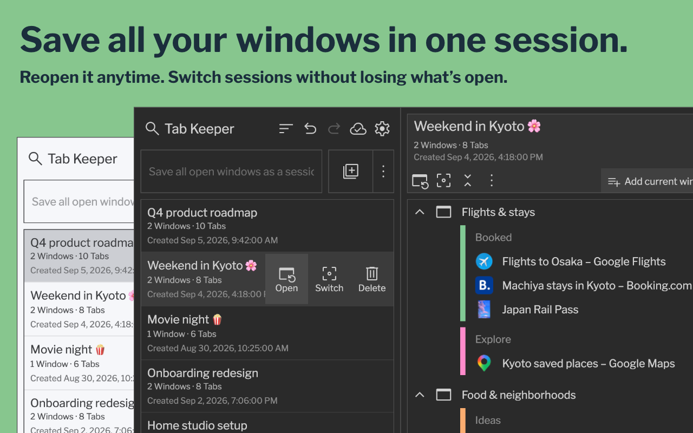

# Tab Keeper - Chrome Tab Manager & Sync Tool

<a href="https://chromewebstore.google.com/detail/tab-keeper-chrome-tab-man/gpibgniomobngodpnikhheifblbpbbah?ref=github" target="_blank"></a>

Tab Keeper is a free session manager for Chrome. Save your open windows and tabs as sessions, restore them later—including tab group names and colors—share any session as a page or PDF, and sync across desktop Chrome without creating an account or providing an email address.

[](https://chromewebstore.google.com/detail/tab-keeper-chrome-tab-man/gpibgniomobngodpnikhheifblbpbbah?ref=github)
[](#changelog)

[](https://raw.githubusercontent.com/justine-george/tab-keeper-react-chrome-extension/main/LICENSE)

<a href="https://chromewebstore.google.com/detail/tab-keeper-chrome-tab-man/gpibgniomobngodpnikhheifblbpbbah?ref=github" target="_blank"></a>

## Features

- **Save & Restore:** Save all your open windows and tabs as a session, or just the current window, then reopen them later.
- **Tab Groups:** Preserve Chrome tab groups, including their names and colors.
- **Share & Export:** Turn any session into a clean page you can print, save as a PDF, or send, or copy all its links at once.
- **Drag to Organize:** Reorder tabs, tab groups, windows and sessions by dragging, and move a tab or a whole group into another saved window.
- **One-Click Switching:** Jump to a saved session while Tab Keeper safely saves your current windows first.
- **Device Sync:** Turn on sync to access your sessions from Chrome desktop browsers connected to the same Chrome profile.
- **Privacy First:** No email address, account setup, or signup required. Sessions stay on your device until you choose to sync.
- **Backup to File:** Save your sessions to a file, and load them back by merging or replacing.
- **Quick Search:** Find any saved tab or tab group as you type.
- **Keyboard Friendly:** Open Tab Keeper with a shortcut, and use it fully from the keyboard or with a screen reader.
- **Multi-Language Support:** Use Tab Keeper in 10 languages.
- **Custom Themes:** Choose from five light and dark themes.

## How It Works

1. Open Tab Keeper and save your current window or all open windows.
2. Search and organize your saved sessions.
3. Restore a session later, or switch sessions while saving your current windows first.

## Screenshots

<a href="https://chromewebstore.google.com/detail/tab-keeper-chrome-tab-man/gpibgniomobngodpnikhheifblbpbbah?ref=github" target="_blank"></a>

[View All Screenshots →](https://github.com/justine-george/tab-keeper-react-chrome-extension/wiki/Screenshots)

## Privacy & Sync

Tab Keeper does not require an email address or a user-created account. It generates an anonymous identifier that Chrome syncs with your browser profile.

Your sessions are stored locally on your device. Tab Keeper asks before it syncs for the first time on each device. When device sync is enabled, saved session data—including tab URLs and titles—is sent to cloud storage so you can access it from other desktop Chrome browsers connected to the same profile. You can delete the cloud copy at any time from Settings → Sync & Backup.

Read the full [privacy policy](PRIVACY.md).

## Changelog

### v.1.9.0 (Latest)

#### Features

- Export a session as a page you can read, print or save as a PDF, and rename titles or hide rows before you share it
- Copy a session's links from its menu: they paste as links into documents and email, and as plain addresses anywhere else
- Export the windows you have open right now, without saving them first
- Load a backup by merging its sessions into yours, or by replacing yours after a confirmation, and a replace now holds on every device that syncs
- Delete your cloud data from Settings → Sync & Backup
- Open the popup with a keyboard shortcut, shown in Settings
- Fold every window in a session from one control in its header
- The extension asks before it first uploads anything to the cloud, on each device, and Settings shows when this device last synced
- A privacy policy, linked from Settings → About

#### Fixes

- A cloud read that fails, for example while offline, no longer replaces what your other devices saved with this device's sessions
- With Auto Sync off, restoring a backup no longer uploads it
- The sync icon now says it is syncing for the whole sync, not only while it uploads
- Icons and fonts now work offline, instead of showing their names as text
- A saved tab keeps the page's name without a site's unread count, such as "(3)"
- A tab can now be picked up by its icon to drag it
- While dragging, the preview shows exactly where a tab lands beside a tab group, and shows a group closing up when its last tab leaves
- The outline that marks where a dragged row will land is now visible in every theme
- The scrollbar is now visible in every theme
- The colored bar beside a tab group is easier to click

#### Improvements

- Settings is reorganized into Display, Language, Sync & Backup, Sessions and About, and each theme shows as a miniature of the popup
- The themes are renamed Paper, Parchment, Petal, Graphite and Ink
- Each language is named in its own language
- A session's Export and Delete now sit in its More actions menu
- The popup uses one type scale and one corner radius, and its buttons show when they are pressed

### v.1.8.0

#### Features

- Drag a tab to a new place in its window, into a Chrome tab group, or out of one
- Drag a whole tab group by its title row to a new place in its window
- Drag a tab or a whole tab group from one saved window into another
- Drag saved windows into a new order inside a session, and sessions into your own order in the list
- Sort the session list by date modified, date saved, name or tab count, with the active order ticked

#### Fixes

- Deleting a tab from a session no longer changes that session's creation date or moves it to the top of the list
- The rating prompt now waits until the extension has done something for you, instead of asking a day after you install it
- The extension now calls itself the same name in every language, and shares to X with the current mark

#### Improvements

- Each session now says whether its date is when it was last edited or when it was first saved

### v.1.7.0

#### Features

- Rename a saved Chrome tab group, and clear its name again, without opening the session
- Change a saved tab group's color from the colored bar beside it
- Click a saved tab group to open its tabs next to the current one, re-formed in Chrome as the group you saved
- Add the current tab to a saved tab group, ungroup it, or delete the group and its tabs

#### Fixes

- Renaming a session now has a visible tick to finish with, like renaming a window already did
- The window rename box now shows its tick without hovering, and runs to the edge of its row
- Settings sections now have even space on both sides instead of sitting off-center

[View All Changelog →](https://github.com/justine-george/tab-keeper-react-chrome-extension/wiki/Changelog)

## Blog Posts

[View All Posts →](https://github.com/justine-george/tab-keeper-react-chrome-extension/wiki/Blog-Posts)

## Development and Contributing

Contributions are welcome! Feel free to open issues or submit pull requests following the established coding style and guidelines.

Install the dependencies and create a production build:

```sh
npm install
npm run build
```

To try the extension locally, open `chrome://extensions`, enable **Developer mode**, choose **Load unpacked**, and select the generated `dist` directory.

Run `npm test` for the unit and component suites, and `npm run test:e2e` for the browser tests against a real build ([details](e2e/README.md)).

## Built With

[React](https://react.dev/), [TypeScript](https://www.typescriptlang.org/), [Redux Toolkit](https://redux-toolkit.js.org/), [Vite](https://vitejs.dev/), [Firebase](https://firebase.google.com/), [Vitest](https://vitest.dev/), [Playwright](https://playwright.dev/), [Emotion](https://emotion.sh/), and [react-i18next](https://react.i18next.com/).

## License

Tab Keeper is released under the [MIT License](https://raw.githubusercontent.com/justine-george/tab-keeper-react-chrome-extension/main/LICENSE).

## Support

Report bugs or request features via [GitHub Issues](https://github.com/justine-george/tab-keeper-react-chrome-extension/issues).
