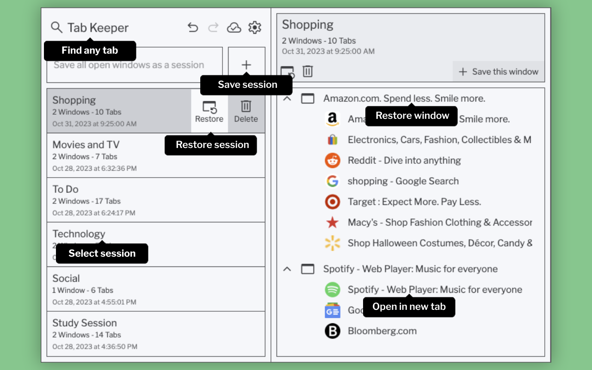

## Table of Contents

1. [Introduction](#tab-keeper---chrome-tab-manager--sync-tool)
2. [Built With](#built-with)
3. [Get Started](#get-started)
4. [Features](#features)
5. [Changelog](#changelog)
6. [Contributing](#contributing)
7. [License](#license)
8. [Support](#support)

# Tab Keeper - Chrome Tab Manager & Sync Tool

Tab Keeper is an intuitive Chrome extension crafted to redefine the way users save, organize, and interact with their browser tabs. With the smart integration of the Chrome Storage API for token generation, Tab Keeper ensures that users can seamlessly sync their data without the need for signing up. This token serves as a unique key to Cloud Firestore, providing a secure and hassle-free experience.
  

## Built With

- [TypeScript](https://www.typescriptlang.org/)
- [React](https://react.dev/)
- [Redux Toolkit](https://redux-toolkit.js.org/)
- [Chrome API](https://developer.chrome.com/docs/extensions/reference/)
- [Vite](https://vitejs.dev/)
- [Vitest](https://vitest.dev/)
- [Cloud Firestore](https://firebase.google.com/docs/firestore)
- [Firebase SDK](https://firebase.google.com/docs/web/setup)
- [Firebase Authentication](https://firebase.google.com/docs/auth)
- [i18n React](https://react.i18next.com/)
- [Emotion CSS](https://emotion.sh/docs/introduction)
- [base64.js](https://github.com/dankogai/js-base64)
- [uuid](https://github.com/uuidjs/uuid)
    

## Get Started

 

## Features

- 🔖 Streamlined Tab Management: Keep your browser tabs well-organized and easily accessible. Move from an unmanaged heap of tabs to a highly organized collection.

- 🌍 Multilingual Support: With i18n React, Tab Keeper now offers internationalization, supporting languages such as English, German, Chinese, Japanese, French, Portuguese, Russian, Spanish, Italian, and Hindi.

- 🌐 Sync Across Devices: Utilize the advanced Chrome integration to synchronize your saved tabs across multiple devices effortlessly. No more manual setups or repetitive logins.

- 🔒 Uncompromised Privacy: Your privacy is paramount. Tab Keeper operates without requiring a separate user login, ensuring that your data is protected.

- 🔍 Quick Tab Search: Find your saved tabs in an instant with our efficient search functionality.

- 🌓 Multiple Themes: Personalize your interface by selecting from a variety of themes.
    

## Changelog

### v.1.3.0 (Latest)

#### Improvements

- Search functionality now supports searching by tab group and window titles
- Bug fixes and stability improvements

### v.1.2.7

#### Improvements

- Timestamp shown in tab group cards now reflects the time of update
- Dependent packages updated to latest versions

### v.1.2.6

#### Improvements

- Newly created chrome tab now opens right next to the current tab
- Bug fixes and stability improvements (Sessions saved using multi-monitor setup now restorable)

### v.1.2.5

#### Improvements

- Improved iconography
- Updated translations
- Bug fixes and stability improvements

### v.1.2.2

#### New Features

- Added "Optimize Memory Usage While Restoring" toggle in Data Management settings to enable memory-optimized restore mode

#### Improvements

- Various bug fixes and stability improvements
- Updated translations

### v.1.2.0

#### New Features

- Mac Shortcut Support: Integrated Mac shortcut keys for enhanced undo/redo functionality

#### Improvements

- Various bug fixes and optimizations

### v.1.1.8

#### New Features

- Translation Support: The application now supports multiple languages including English, German, Chinese, Japanese, French, Portuguese, Russian, Spanish, Italian, and Hindi

#### Improvements

- Various bug fixes and optimizations

### v.1.1.6

#### Improvements

- Various bug fixes and optimizations

### v.1.1.5

#### New Features

- Window Management: The application now recalls window positions and sizes for a seamless restoration experience
- Tab Groups: Easily add the current window to an existing tab group
- Renaming: Capability to rename tab groups and window groups
- Themes: Expanded selection of customizable themes for enhanced user experience

#### Improvements

- Various bug fixes and optimizations

### v.1.1.2

#### Enhancements

- Settings UI: Overhauled settings categories for improved navigation
- User Experience: Multiple tweaks and adjustments for an enriched user experience

#### Improvements

- Addressed multiple bugs for better stability

### v.1.0.9

#### New Features

- Privacy Boost: Tab Keeper now utilizes the browser's inbuilt sync feature for enhanced privacy, thus eliminating the need for a separate user login or email

#### Improvements

- Syncing: Improved handling of sync collisions, ensuring smoother operation across multiple devices
    

## Contributing

Contributions are welcome! Feel free to open issues or submit pull requests following the established coding style and guidelines.
  

## License

Tab Keeper is released under the [MIT License](https://raw.githubusercontent.com/justine-george/tab-keeper-react-chrome-extension/main/LICENSE).
  

## Support

Report bugs or request features via [GitHub Issues](https://github.com/justine-george/tab-keeper-react-chrome-extension/issues)
